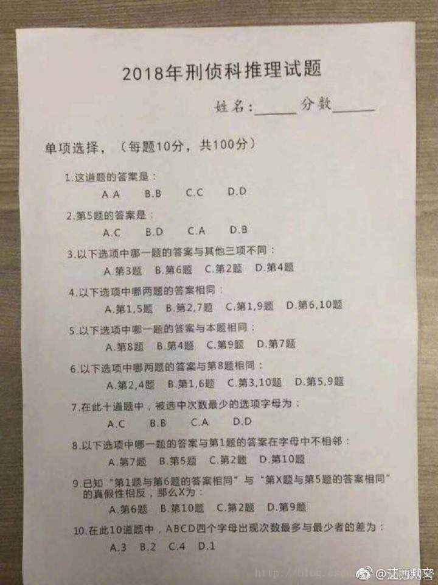
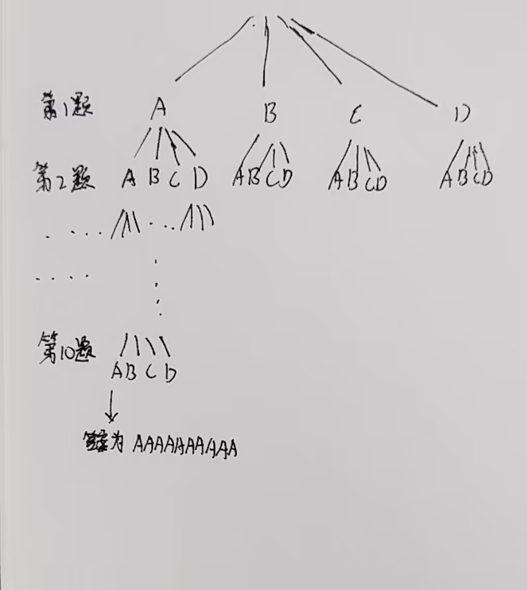

前几年比较火的《2018年刑侦科推理试题》，但我最近才看到，这里写一下如何利用C++或Python在几毫秒内求得结果。

<!-- more -->



## 分析

显然，可以用暴力解决，在4<sup>10</sup>个答案内依次进行遍历看答案是否合规，网上能搜索到的教程一般也是这种暴力解法，一般有如下两种形式：

- 10个for循环嵌套
- 递归，递归深度为10，每一个新的递归都向下递归四次（即ABCD四个选项）

由于上述解法不美观且有很多示例，这里则不做补充。接下来讲具体思路。

递归的思想是没问题的，这里我用手稿演示一下。 



可以看出递归的思路是一颗高为10的完全四叉树，如果要完全验证这么多答案是否合理是很耗费时间的，那么有没有什么方法可以加快运算速度呢，当然是有的，就是剪枝，有如下两种思路：

- 不需要递归至第十层才判断是否合理，而在中途就选择性进行回溯。例如第一题和第五题答案不同（这里随便写的），那么递归至第五层时，就应该检验当前的答案和第一题的答案是否一致，如果一致，说明答案已经不合理了，不需要再递归下去。
- 另外一种优化方法，十道题并没有固定的递归顺序，所以先递归第一题和先递归第二题本质是一样的，我们可以先让更容易得出结果的题目先递归

知晓此思路后，利用C++和python 分别写出代码，您也可以在我的[GitHub查看代码](https://github.com/YallonGao/idea_inference2018)。

## 解题`Python`

```python
import time


# Q2，上限题数是5
def Q2():
    if a[2] == 1 and a[5] == 3 or \
            a[2] == 2 and a[5] == 4 or \
            a[2] == 3 and a[5] == 1 or \
            a[2] == 4 and a[5] == 2:
        return True
    return False


# Q3，上限题数是6
def Q3():
    if a[3] == 1 and a[6] != a[3] and a[6] == a[2] and a[2] == a[4] or \
            a[3] == 2 and a[6] != a[3] and a[3] == a[2] and a[2] == a[4] or \
            a[3] == 3 and a[2] != a[3] and a[3] == a[6] and a[6] == a[4] or \
            a[3] == 4 and a[4] != a[3] and a[3] == a[2] and a[2] == a[6]:
        return True
    return False


# Q4，上限题数是10
def Q4():
    if a[4] == 1 and a[1] == a[5] or \
            a[4] == 2 and a[2] == a[7] or \
            a[4] == 3 and a[1] == a[9] or \
            a[4] == 4 and a[6] == a[10]:
        return True
    return False


# Q5，上限题数是9
def Q5():
    if a[5] == 1 and a[5] == a[8] or \
            a[5] == 2 and a[5] == a[4] or \
            a[5] == 3 and a[5] == a[9] or \
            a[5] == 4 and a[5] == a[7]:
        return True
    return False


# Q6，上限题数是10
def Q6():
    if a[6] == 1 and a[8] == a[2] and a[8] == a[4] or \
            a[6] == 2 and a[8] == a[1] and a[8] == a[6] or \
            a[6] == 3 and a[8] == a[3] and a[8] == a[10] or \
            a[6] == 4 and a[8] == a[5] and a[8] == a[9]:
        return True
    return False


# Q7，上限题数是10
def Q7():
    count = [0, 0, 0, 0]
    for i in range(1, 11):
        count[a[i] - 1] += 1
    min_count = min(count)
    min_index = count.index(min_count) + 1
    if a[7] == 1 and min_index == 3 or \
            a[7] == 2 and min_index == 2 or \
            a[7] == 3 and min_index == 1 or \
            a[7] == 4 and min_index == 4:
        return True
    return False


# Q8，上限题数是10
def Q8():
    if a[8] == 1 and (a[7] != a[1] + 1 or a[7] != a[1] - 1) or \
            a[8] == 2 and (a[5] != a[1] + 1 or a[5] != a[1] - 1) or \
            a[8] == 3 and (a[2] != a[1] + 1 or a[2] != a[1] - 1) or \
            a[8] == 4 and (a[10] != a[1] + 1 or a[10] != a[1] - 1):
        return True
    return False


# Q9，上限题数是10
def Q9():
    if a[9] == 1 and ((a[1] == a[6]) ^ (a[6] == a[5])) or \
            a[9] == 2 and ((a[1] == a[6]) ^ (a[10] == a[5])) or \
            a[9] == 3 and ((a[1] == a[6]) ^ (a[2] == a[5])) or \
            a[9] == 4 and ((a[1] == a[6]) ^ (a[9] == a[5])):
        return True
    return False


# Q10，上限题数是10
def Q10():
    count = [0, 0, 0, 0]
    for i in range(1, 11):
        count[a[i] - 1] += 1
    min_count = min(count)
    max_count = max(count)
    dif = max_count - min_count
    if a[10] == 1 and dif == 3 or \
            a[10] == 2 and dif == 2 or \
            a[10] == 3 and dif == 4 or \
            a[10] == 4 and dif == 1:
        return True
    return False


def print_answer():
    option = ["A", "B", "C", "D"]
    global all_status
    all_status += 1
    print(all_status, end=" : ")
    for i in range(1, 11):
        print("%s" % option[a[i] - 1], end=" ")
    print()


def violence(h):
    if h > 10:
        return
    # 极致的优化，极致的享受
    if h == 3:
        if a[3] == 2 and a[3] != a[2] or \
                a[3] == 4 and a[3] != a[2]:
            return
    if h == 4:
        if a[3] == 1 and a[2] != a[4] or \
                a[3] == 2 and not (a[3] == a[2] and a[2] == a[4]) or \
                a[3] == 4 and a[3] != a[2]:
            return
    # 正常优化
    if h == 5 and not Q2():
        return
    if h == 6 and not Q3():
        return
    if h == 9 and not Q5():
        return
    if h == 10:
        if Q4() and Q6() and Q8() and Q9() and Q7() and Q10():
            print_answer()
            pass
        return
    # 极致的优化，极致的难受
    for j in range(1, 5):
        a[h + 1] = j
        violence(h + 1)
        a[h + 1] = 0


if __name__ == '__main__':
    time_start = time.time()
    a = [0 for i in range(11)]
    all_status = 0
    violence(0)
    time_end = time.time()
    print("%d条结果，用时%s秒" % (all_status, time_end - time_start))

```

## 解题`C++`

```c++
#include <iostream>
#include <time.h>
using namespace std;

int a[11] = {0, 0, 0, 0, 0, 0, 0, 0, 0, 0, 0};
char option[4] = {'A', 'B', 'C', 'D'};

// Q2，上限题数是5
bool Q2() {
	if (a[2] == 1 && a[5] == 3 || \
	        a[2] == 2 && a[5] == 4 || \
	        a[2] == 3 && a[5] == 1 || \
	        a[2] == 4 && a[5] == 2)
		return true;
	return false;
}

// Q3，上限题数是6
bool Q3() {
	if (a[3] == 1 && a[6] != a[3] && a[6] == a[2] && a[2] == a[4] || \
	        a[3] == 2 && a[6] != a[3] && a[3] == a[2] && a[2] == a[4] || \
	        a[3] == 3 && a[2] != a[3] && a[3] == a[6] && a[6] == a[4] || \
	        a[3] == 4 && a[4] != a[3] && a[3] == a[2] && a[2] == a[6])
		return true;
	return false;
}

// Q4，上限题数是10not
bool Q4() {
	if (a[4] == 1 && a[1] == a[5] || \
	        a[4] == 2 && a[2] == a[7] || \
	        a[4] == 3 && a[1] == a[9] || \
	        a[4] == 4 && a[6] == a[10])
		return true;
	return false;
}

// Q5，上限题数是9
bool Q5() {
	if (a[5] == 1 && a[5] == a[8] || \
	        a[5] == 2 && a[5] == a[4] || \
	        a[5] == 3 && a[5] == a[9] || \
	        a[5] == 4 && a[5] == a[7])
		return true;
	return false;
}

// Q6，上限题数是10
bool Q6() {
	if (a[6] == 1 && a[8] == a[2] && a[8] == a[4] || \
	        a[6] == 2 && a[8] == a[1] && a[8] == a[6] || \
	        a[6] == 3 && a[8] == a[3] && a[8] == a[10] || \
	        a[6] == 4 && a[8] == a[5] && a[8] == a[9])
		return true;
	return false;
}

// Q7，上限题数是10
bool Q7() {
	int count[4] = {0, 0, 0, 0};
	for (int i = 1; i <= 10; i++) {
		count[a[i] - 1]++;
	}
	int min_index = 0;
	int min_count = count[0];
	for (int i = 1; i < 4; i++) {
		if (count[i] < min_count) {
			min_index = i;
			min_count = count[i];
		}

	}
	min_index += 1;
	if ( a[7] == 1 && min_index == 3 || \
	        a[7] == 2 && min_index == 2 || \
	        a[7] == 3 && min_index == 1 || \
	        a[7] == 4 && min_index == 4)
		return true;
	return false;
}

// Q8，上限题数是10
bool Q8() {
	if (a[8] == 1 && (a[7] != a[1] + 1 || a[7] != a[1] - 1) || \
	        a[8] == 2 && (a[5] != a[1] + 1 || a[5] != a[1] - 1) || \
	        a[8] == 3 && (a[2] != a[1] + 1 || a[2] != a[1] - 1) || \
	        a[8] == 4 && (a[10] != a[1] + 1 || a[10] != a[1] - 1))
		return true;
	return false;
}

// Q9，上限题数是10
bool Q9() {
	if (a[9] == 1 && ((a[1] == a[6]) ^ (a[6] == a[5])) || \
	        a[9] == 2 && ((a[1] == a[6]) ^ (a[10] == a[5])) || \
	        a[9] == 3 && ((a[1] == a[6]) ^ (a[2] == a[5])) || \
	        a[9] == 4 && ((a[1] == a[6]) ^ (a[9] == a[5])))
		return true;
	return false;

}

// Q10，上限题数是10
bool Q10() {
	int count[4] = {0, 0, 0, 0};
	for (int i = 1; i <= 10; i++) {
		count[a[i] - 1]++;
	}
	int min_count = 0;
	int max_count = 0;
	for (int i = 1; i < 4; i++) {
		if (count[i] < min_count)
			min_count = count[i];
		if (count[i] > min_count)
			max_count = count[i];
	}
	int dif = max_count - min_count;
	if (a[10] == 1 && dif == 3 || \
	        a[10] == 2 && dif == 2 || \
	        a[10] == 3 && dif == 4 || \
	        a[10] == 4 && dif == 1)
		return true;
	return false;
}

void print_answer() {
	for (int i = 1; i <= 10; i++) {
		printf("%c ", option[a[i] - 1]);
	}
	printf("\n");
}

void violence(int h) {
	if (h > 10)
		return;
	// 极致的优化，极致的享受
	if ( h == 3) {
		if (a[3] == 2 and a[3] != a[2] || \
		        a[3] == 4 and a[3] != a[2])
			return;
	}
	if (h == 4) {
		if (a[3] == 1 and a[2] != a[4] || \
		        a[3] == 2 and !(a[3] == a[2] and a[2] == a[4]) || \
		        a[3] == 4 and a[3] != a[2])
			return;
	}
	// 正常优化
	if (h == 5 && !Q2())
		return;
	if (h == 6 && !Q3())
		return;
	if (h == 9 && !Q5())
		return;
	if (h == 10) {
		if (Q4() && Q6() && Q8() && Q9() && Q7()) {
			print_answer();
			return;
		}
	}
	for (int i = 1; i <= 4; i++) {
		a[h + 1] = i;
		violence(h + 1);
		a[h + 1] = 0;
	}
}

int main() {
	clock_t start, end;
	start = clock();
	violence(0);
	end = clock();
	printf("运行时间: %f秒", (double)(end - start) / CLOCKS_PER_SEC);
	return 0;
}

```

## 结果

电脑配置：NVIDAGTX1050Ti（官方算力表为6.1），i7-8750H十六核处理器，电脑已使用四年半

运行结果：都是几毫秒内解决，并且C++可以达到1毫秒

（我是双系统，所以都测一下，并且每次运行时间可能有差异，随机取一次，且精确至五位小数，您可以使用代码多跑几次求平均运行时间）

|             |  Python  |   C++    |
| :---------: | :------: | :------: |
|  windows10  | 0.00698s | 0.00200s |
| Ubuntu22.04 | 0.00463s | 0.00139s |

可以发现：

- 同样的代码逻辑实现，python比C++慢很多
- 同样的代码同样的设备，Ubuntu比windows更快
